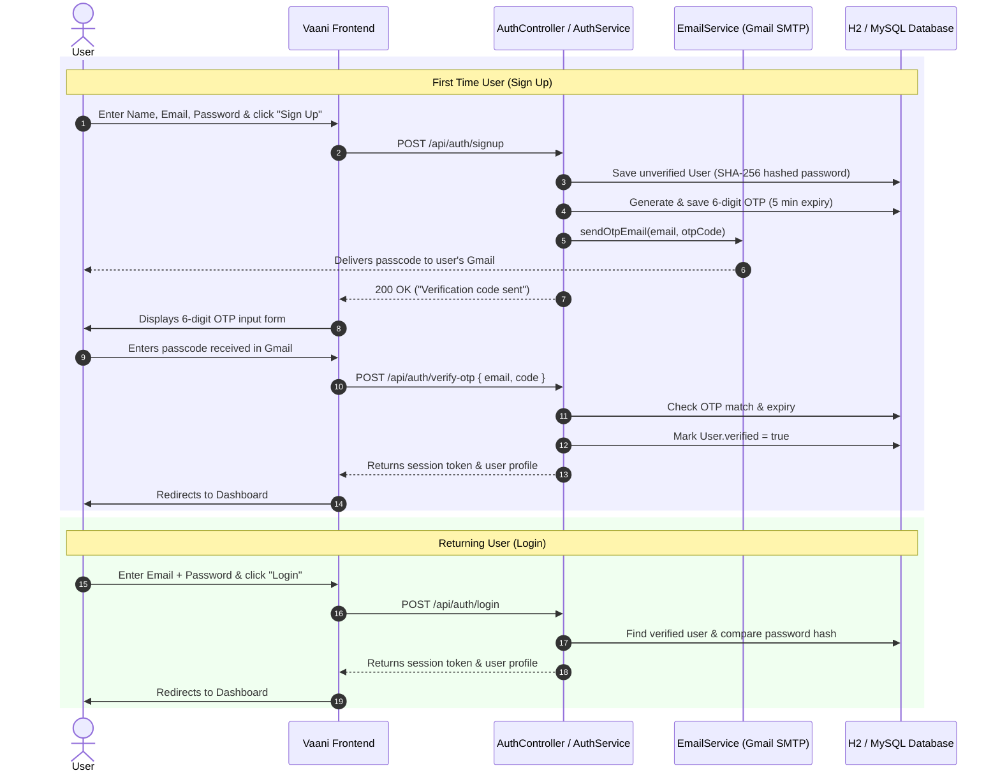

# Vaani — AI Voice to Text & Summarizer 🎙️✨

**Vaani** is an AI-powered voice recording, transcription, and lecture summarization platform. It enables students, educators, and professionals to record voice notes or upload audio files, automatically generate speech-to-text transcripts using Whisper AI, and receive concise, structured summaries with key takeaways.

---

## 🚀 Key Features

- **Email OTP Authentication**:
  - **First-time Users (Sign Up)**: Register with name, email, and password. A secure 6-digit passcode (OTP) is sent directly to your Gmail. Enter the passcode to verify your account and gain access.
  - **Returning Users (Login)**: Sign in directly using your registered email and password.
  - **Session Security**: Bearer token session authentication with instant logout support.
- **Voice Recording & Audio Upload**:
  - In-browser live microphone recording with audio visual timer.
  - Audio file upload support (`.mp3`, `.wav`, `.webm`, `.m4a` up to 200 MB).
- **AI Speech-to-Text Transcription**:
  - Integrated with OpenAI Whisper / Groq Whisper API, with fallback to local Whisper model or custom notes.
- **AI Summarization & Analytics**:
  - Executive summary generation.
  - Key points and actionable insights extraction.
  - Tagging, keyword extraction, word counts, and estimated reading time.
- **Audio Playback & Library**:
  - In-browser audio streaming and playback.
  - Download recorded audio in `.webm` format.
  - Lecture and professor metadata tracking.
  - Browser local storage fallback mode if backend services are offline.

---

## 🛠️ Tech Stack

- **Backend**:
  - Java 21 & Spring Boot 3.2.5
  - Spring Data JPA & Hibernate
  - Spring Boot Starter Mail (Gmail SMTP integration)
  - H2 embedded database (file-persisted at `./data/vaanidb`) or MySQL
- **Frontend**:
  - Clean, modern UI (Vanilla JavaScript, HTML5, CSS3)
  - HTML5 MediaRecorder API & Audio Player
- **Speech & AI**:
  - Python Whisper (`faster-whisper`) / OpenAI Whisper API / Groq API

---

## 📂 Project Structure

```
vaani-main/
├── backend/
│   ├── src/main/java/com/vaani/
│   │   ├── VaaniApplication.java
│   │   ├── config/
│   │   │   ├── AuthFilter.java          # Bearer token verification filter
│   │   │   ├── DatabaseSeeder.java      # Sample lectures seeder
│   │   │   └── WebConfig.java           # CORS & static route handler
│   │   ├── controller/
│   │   │   ├── AuthController.java      # Signup, OTP verify, Login, Logout APIs
│   │   │   └── RecordingController.java # CRUD endpoints for audio recordings
│   │   ├── dto/
│   │   │   └── RecordingResponseDto.java
│   │   ├── model/
│   │   │   ├── Otp.java                 # OTP verification model (5-min TTL)
│   │   │   ├── Recording.java           # Audio & transcript entity
│   │   │   └── User.java                # User credentials & verification status
│   │   ├── repository/
│   │   │   ├── OtpRepository.java
│   │   │   ├── RecordingRepository.java
│   │   │   └── UserRepository.java
│   │   └── service/
│   │       ├── AIService.java           # Summary & NLP analytics engine
│   │       ├── AuthService.java         # Password hashing & auth workflow
│   │       ├── EmailService.java        # Gmail SMTP mail sender
│   │       ├── RecordingService.java    # Recording storage & async worker
│   │       └── WhisperService.java      # Speech-to-text runner
│   ├── src/main/resources/
│   │   └── application.properties       # Database, mail, and server config
│   ├── pom.xml
│   └── transcribe_whisper.py            # Local Whisper Python script
├── css/
│   ├── auth.css                         # Styles for login & signup forms
│   └── style.css                        # Dashboard & recorder styles
├── js/
│   ├── auth.js                          # Login, signup & OTP frontend logic
│   └── app.js                           # Dashboard, recording, and player logic
├── index.html                           # Main dashboard & recording workspace
├── login.html                           # Login / Signup / OTP verification page
├── start-services.sh                    # Service launch script
├── vaani.png                            # Project logo
└── README.md
```

---

## ⚙️ Configuration & Gmail Setup

To send OTP verification emails to users' Gmail accounts, configure a **Gmail App Password**:

### 1. Generate a Gmail App Password
1. Go to your [Google Account Security Settings](https://myaccount.google.com/security).
2. Ensure **2-Step Verification** is turned **ON**.
3. Under *2-Step Verification*, navigate to **App passwords** (or search for "App passwords" in the search bar).
4. Enter an app name (e.g., `Vaani`) and click **Create**.
5. Copy the generated 16-character password (e.g., `abcd efgh ijkl mnop`).

### 2. Configured Gmail Credentials
The application is pre-configured with your Gmail credentials in `backend/src/main/resources/application.properties`:
- **Sender Email**: `programmmariojs8@gmail.com`
- **SMTP Server**: `smtp.gmail.com:587` (STARTTLS enabled)

You can also override them anytime via environment variables:
```bash
export VAANI_MAIL_USERNAME="programmmariojs8@gmail.com"
export VAANI_MAIL_PASSWORD="your-app-password"
```

*(Optional) If using OpenAI or Groq for speech recognition:*
```bash
export GROQ_API_KEY="your-groq-api-key"
# or
export OPENAI_API_KEY="your-openai-api-key"
```

> **Development Note**: Every time an OTP is generated, the 6-digit passcode is also displayed directly in the backend terminal logs (`Vaani Verification Code for [email]: XXXXXX`) for instant visibility and testing.

---

## 🏃 Quick Start

### 1. Prerequisites
- **Java 21** or higher
- **Maven 3.8+**
- (Optional) **Python 3.9+** with `faster-whisper` for offline local transcription

### 2. Run the Application
You can run the startup script from the root directory:

```bash
./start-services.sh
```

Or run via Maven inside `backend/`:

```bash
cd backend
mvn spring-boot:run
```

### 3. Open the App in Browser
Navigate to:
- **Login / Signup**: [http://localhost:8080/login](http://localhost:8080/login) or [http://localhost:8080/login.html](http://localhost:8080/login.html)
- **Main Dashboard**: [http://localhost:8080](http://localhost:8080) *(automatically redirects to login if unauthenticated)*

---

## 🔐 How Authentication Works



---

## 📡 REST API Reference

### Authentication Endpoints

| Method | Endpoint | Description | Request Body |
|---|---|---|---|
| `POST` | `/api/auth/signup` | Register new user & send OTP to Gmail | `{"name":"string", "email":"string", "password":"string"}` |
| `POST` | `/api/auth/verify-otp` | Verify 6-digit code and activate user | `{"email":"string", "code":"123456"}` |
| `POST` | `/api/auth/login` | Log in existing verified user | `{"email":"string", "password":"string"}` |
| `GET` | `/api/auth/me` | Fetch currently logged-in user profile | Requires `Authorization: Bearer <token>` |
| `POST` | `/api/auth/logout` | Invalidate current user session | Requires `Authorization: Bearer <token>` |

### Recordings Endpoints

| Method | Endpoint | Description |
|---|---|---|
| `GET` | `/api/recordings` | List all recordings (requires auth) |
| `GET` | `/api/recordings/{id}` | Get specific recording details (requires auth) |
| `GET` | `/api/recordings/{id}/audio` | Stream or download recording audio file |
| `POST` | `/api/recordings` | Upload audio and trigger AI transcription |
| `DELETE` | `/api/recordings/{id}` | Delete a recording (requires auth) |

---

## 📄 License
This project is open source and available under the [MIT License](LICENSE).
